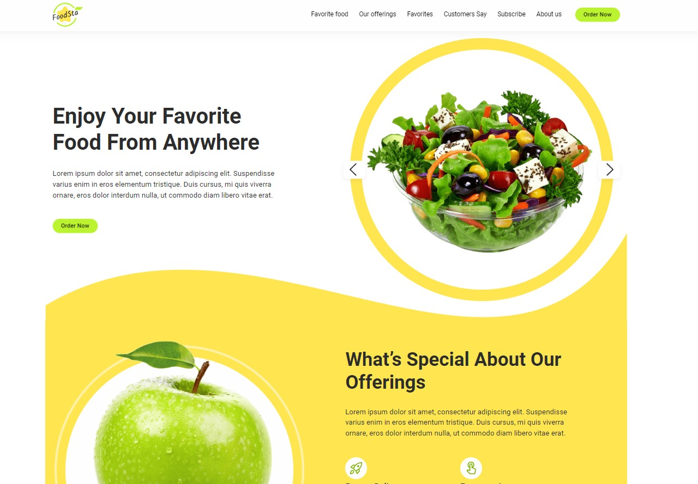

## App view

## Description of the project

A website with adaptive layouts desing for Food Business.

## Implemented

1. Fixed header with logo and navigation. Logo can bring you back to the top of the page.
2. In mobile version, navigation is placed inside the mobile-menu, which can be opened by click on the burger-button.
3. Attractive JavaScript slider with controls. It is not available in mobile version.
4. Modal window with form for making an order. Can be opened by click on the 'Order now' button.
5. Illustrative sections with responsive images, feedback and subscription form.
6. Footer.

## Technology stack:

## Team of developers:

- [Serhii Vasylenko](https://github.com/serhii-vasylenko) - Team-lead (Frontend), developer
- [Liudmyla Cheremisina](https://github.com/Liudmyla-ukraineif) - Scrum master, Frontend developer 
- [Oleksandra Stusova](https://github.com/OleksandraSt) - Frontend developer
- [Iryna Akulova](https://github.com/IraAkulova) - Frontend developer
- [Chegil Bogdan](https://github.com/chegil) - Frontend developer
- [Daniil Popov](https://github.com/DaniilPopov0809) - Frontend developer
- [Karyna Kostynska](https://github.com/KarynaKostynska) - Frontend developer
- [Kostya Semenchuk](https://github.com/modie22?tab=repositories) - Frontend developer
- [Kateryna Nikitina](https://github.com/KaterynaNikitina) - Frontend developer
- [Ihor Havriliuyk](https://github.com/goshik73) - Frontend developer

## Link to web app:
[Link to web app](https://serhii-vasylenko.github.io/team16-project/)
